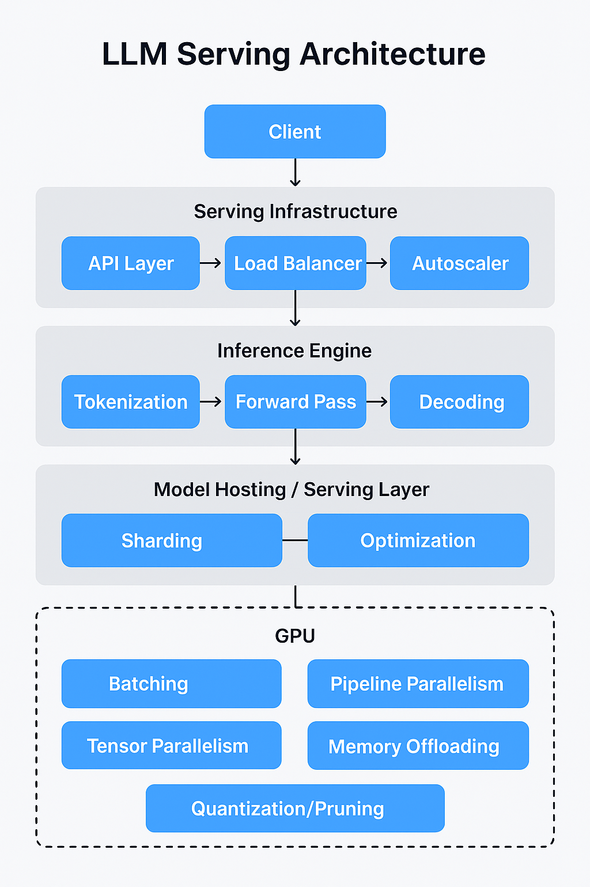

1. LLM Serving Architecture
   - Model Hosting / Serving Layer
     - Model Quantization: Converting Model from high precision to low precision, can be trained using quantization or not.
   - Inference Engine
   - Serving Infra
   - Optimization Techniques
   - Client Application Layer
2. 

